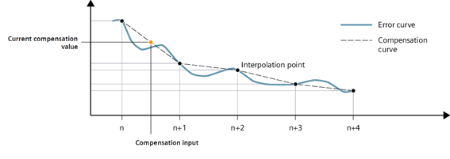
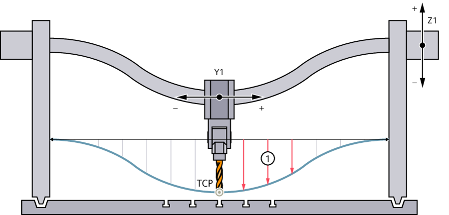

# @simatic-ax/lgencomp

## Description

The LGenComp (Generic Compensation) library provides functionality to compensate the position of a SIMATIC Motion Control technology object based on a compensation table.
Different influences and the resulting deviations can be addressed, such as:

- Mechanical sag
- Leadscrew imperfections
- Angularity errors
- temperature-related deviations

The library operates by directly manipulating encoder increments using predefined compensation tables with linear interpolation between data points.

## Getting started

Install with Apax:

> If not yet done login to the GitHub registry first.
> More information you'll find [here](https://github.com/simatic-ax/.github/blob/main/docs/personalaccesstoken.md)

```cli
apax add @simatic-ax/lgencomp
```

Add the namespace in your ST code:

```iec-st
Using Simatic.Ax.LGenComp;
```

## Mode of operation

During operation, the relevant compensation value is fetched from a predefined table. A typical input for the compensation table is the actual axis position. Other influences (like temperature) can also be addressed.
The compensation table contains the information in the form of an array of x and y values. These x/y pairs are representing the interpolation points of the compensation relation. Between the points, a linear interpolation is performed.



> NOTE
>
> When referencing a machine axis, the actual position value system of the axis is synchronized with the machine geometry.
>
> It is recommended that the compensation table is structured in a way that the compensation value has the value “0” at the reference point of the axis.
>
> Ideally, a reference point with neglectable mechanical deviation is chosen.
>

The values for the compensation relation need to be captured by the user, typically during commissioning.

## Library functionality

| Functions   | Description             |
|-------------|-------------------------|
| [LGenComp_GetCompensationValueLinear](./docs/functions/LGenComp_GetCompensationValueLinear.md)      | Function for retrieving a compensation value from a compensation table for a given x-value with a linear interpolation. |

| Function Blocks | Description           |
|-----------------|-----------------------|
| [LGenComp_Compensation](./docs/function-blocks/LGenComp_Compensation.md)         | Function block for compensating an axis position by a compensation value via encoder increment adjustment |

## Examples

This section demonstrates typical use cases for the LGenComp library.

### Setup and Initialization

Before using the compensation functionality, you need to set up the basic infrastructure.
The example is based on a TIAX workflow, where the Hardware Configuration and the Technology Object are implemented in a TIA Portal project.

#### 1. Configuration with MC_PreServo Task

The compensation must be called in an MC_PreServo task. Configure this in your configuration file and pass the axis references to the program inputs. The configuration and main program cover the [two-dimensional sag compensation](#two-dimensional-sag-compensation) use case. For the leadscrew example, the configuration needs to be adjusted.

```iec-st
USING Siemens.Simatic.Tasks;
USING Siemens.Simatic.MotionControl.Native;

CONFIGURATION MyConfiguration
    TASK Main(Priority := 1);
    TASK PreServo : MC_PreServo;  // Define PreServo task

    // Assign compensation program with axis references passed as inputs
    PROGRAM PrgPreServo WITH PreServo : MotionPreServoProgram(
        xAxisRef := axisRefs[1],
        yAxisRef := axisRefs[2],
        zAxisRef := axisRefs[3]
    );

    PROGRAM P1 WITH Main: MainProgram;  // Main motion control program

    VAR_GLOBAL
        // Technology object Data-blocks (as DB_ANY, numbers derived from TIA Portal configuration)
        posDBs : ARRAY[1..3] OF DB_ANY := [UINT#1, UINT#2, UINT#3];

        // Axis references (converted from DB_ANY)
        axisRefs : ARRAY[1..3] OF REF_TO TO_PositioningAxis;

        // Compensation arrays
        compensationArrayX : ARRAY[0..19] OF LGenComp_typeCompensationElement;
        compensationArrayY : ARRAY[0..19] OF LGenComp_typeCompensationElement;
    END_VAR
END_CONFIGURATION
```

#### 2. Obtaining Axis References

Convert technology objects (DB_ANY) to axis references using the `AsPositioningAxisRef()` function from the Siemens.Simatic.MotionControl.Native package. This is typically done during initialization:

```iec-st
USING Siemens.Simatic.MotionControl.Native;

PROGRAM MainProgram
    VAR_EXTERNAL
        posDBs : ARRAY[1..3] OF DB_ANY;
        axisRefs : ARRAY[1..3] OF REF_TO TO_PositioningAxis;
    END_VAR

    VAR
        initialized : BOOL;
    END_VAR

    VAR_TEMP
        i : UINT;
    END_VAR

    // One-time initialization
    IF NOT initialized THEN
        // Convert DB_ANY to axis references
        FOR i := 1 TO UINT#3 DO
            axisRefs[i] := AsPositioningAxisRef(posDBs[i]);
        END_FOR;

        initialized := TRUE;
    END_IF;
END_PROGRAM
```

#### 3. Initializing Compensation Arrays

Define and initialize your compensation tables based on measured data. The array elements must be sorted by xValue. The initalization routine in the main program is adjusted accordingly.

```iec-st
PROGRAM MainProgram
    VAR_EXTERNAL
        posDBs : ARRAY[1..3] OF DB_ANY;
        axisRefs : ARRAY[1..3] OF REF_TO TO_PositioningAxis;
        compensationArrayX : ARRAY[0..19] OF LGenComp_typeCompensationElement;
        compensationArrayY : ARRAY[0..19] OF LGenComp_typeCompensationElement;
    END_VAR

    VAR
        initialized : BOOL;
    END_VAR

    VAR_TEMP
        i : UINT;
    END_VAR

    // One-time initialization
    IF NOT initialized THEN
        // Convert DB_ANY to axis references
        FOR i := 1 TO UINT#3 DO
            axisRefs[i] := AsPositioningAxisRef(posDBs[i]);
        END_FOR;

        // Initialize compensation table
        // xValues: positions where compensation was measured
        // yValues: measured compensation at those positions
        FOR i := 0 TO UINT#19 DO
            compensationArrayX[i].xValue := 10.0 * i;      // Positions: 0, 10, 20, ... 190
            compensationArrayX[i].yValue := 0.1 * (i*i);   // Compensation values (example)

            compensationArrayY[i].xValue := 15.0 * i;      // Positions: 0, 15, 30, ... 285
            compensationArrayY[i].yValue := (0.1 + i*0.2) * (i*i);   // Compensation values (example)
        END_FOR;

        initialized := TRUE;
    END_IF;
END_PROGRAM
```

> **Note**
> In production, compensation values should be determined through measurement and calibration during commissioning, not calculated as in this example.

### Two-dimensional sag compensation

The library allows summation of multiple compensations on a single axis. A common use case is a two-dimensional sag compensation for machines with portal kinematics, where the effective position of the Z-axis is corrected depending on both X and Y positions.



**Implementation:**

This example uses the axis references passed from the configuration as inputs, maintaining readable variable names (xAxisRef, yAxisRef, zAxisRef) in the program.

```iec-st
USING Simatic.Ax.LGenComp;
USING Siemens.Simatic.MotionControl.Native;

PROGRAM MotionPreServoProgram
    VAR_EXTERNAL
        // Compensation tables (initialized in main program)
        compensationArrayX : ARRAY [0..19] OF LGenComp_typeCompensationElement;
        compensationArrayY : ARRAY [0..19] OF LGenComp_typeCompensationElement;
    END_VAR

    VAR_INPUT
        enableComp : BOOL;                                   // Enable compensation
        xAxisRef : REF_TO TO_PositioningAxis;               // X-axis (from axisRefs[1])
        yAxisRef : REF_TO TO_PositioningAxis;               // Y-axis (from axisRefs[2])
        zAxisRef : REF_TO TO_PositioningAxis;               // Z-axis (from axisRefs[3])
    END_VAR

    VAR
        compZfromX : LGenComp_Compensation;   // Compensation instance for X influence
        compZfromY : LGenComp_Compensation;   // Compensation instance for Y influence
        compValueX : LREAL;                   // Compensation value from X position
        compValueY : LREAL;                   // Compensation value from Y position
        statusX : WORD;                       // Status X
        statusY : WORD;                       // Status Y
        xPos : LREAL;                         // X actual position
        yPos : LREAL;                         // Y actual position
    END_VAR

    IF xAxisRef <> NULL AND yAxisRef <> NULL AND zAxisRef <> NULL THEN
        // Get current positions
        xPos := xAxisRef^.ActualPosition;
        yPos := yAxisRef^.ActualPosition;

        // Calculate compensation values based on X and Y positions
        compValueX := LGenComp_GetCompensationValueLinear(xPos, compensationArrayX, statusX);
        compValueY := LGenComp_GetCompensationValueLinear(yPos, compensationArrayY, statusY);

        // Apply both compensations to Z-axis
        compZfromX(
            enable := enableComp,
            compensationValue := compValueX,
            axis := zAxisRef
        );

        compZfromY(
            enable := enableComp,
            compensationValue := compValueY,
            axis := zAxisRef
        );
    END_IF;
END_PROGRAM
```

In this example, both the X-axis and Y-axis positions are evaluated as inputs for separate compensation table lookups. Two instances of [`LGenComp_Compensation`](lgencomp/docs/function-blocks/LGenComp_Compensation.md) are called, both targeting the Z-axis with their respective compensation increments.

### Leadscrew compensation

An axis can serve as both the input and target of a compensation. A practical use case is compensating for leadscrew imperfections. While an ideal leadscrew provides a perfect translation between rotational and linear movement based on its pitch, real mechanical systems exhibit certain imperfections.

**Implementation:**

For leadscrew compensation, you would configure the program call to pass a single axis reference:

```iec-st
// In configuration:
PROGRAM PrgPreServo WITH PreServo : MotionPreServoProgram(
    axisRef := axisRefs[1]  // Pass single axis for leadscrew compensation
);
```

The program implementation:

```iec-st
USING Simatic.Ax.LGenComp;
USING Siemens.Simatic.MotionControl.Native;

PROGRAM MotionPreServoProgram
    VAR_EXTERNAL
        // Compensation table (initialized in main program)
        leadscrewCompArray : ARRAY [0..49] OF LGenComp_typeCompensationElement;
    END_VAR

    VAR_INPUT
        enableComp : BOOL;                                   // Enable compensation
        axisRef : REF_TO TO_PositioningAxis;                // Axis reference (from axisRefs[1])
    END_VAR

    VAR
        compLeadscrew : LGenComp_Compensation;   // Compensation instance
        compValue : LREAL;                       // Current compensation value
        lastCompValue : LREAL;                   // Previous compensation value
        uncompensatedPos : LREAL;                // Position without compensation
        status : WORD;                           // Status
    END_VAR

    IF axisRef <> NULL THEN
        // Calculate uncompensated position by subtracting the last applied compensation
        uncompensatedPos := axisRef^.ActualPosition - lastCompValue;

        // Retrieve new compensation value based on uncompensated position
        compValue := LGenComp_GetCompensationValueLinear(uncompensatedPos, leadscrewCompArray, status);

        // Apply compensation to the same axis
        compLeadscrew(
            enable := enableComp,
            compensationValue := compValue,
            axis := axisRef
        );

        // Store for next cycle
        lastCompValue := compValue;
    END_IF;
END_PROGRAM
```

In leadscrew compensation, the encoder manipulation alters the same technology object that serves as input for the compensation table lookup. Therefore, the last compensation value must be subtracted before evaluating the compensation array to obtain the true mechanical position.

> **Note**
> Since the generic compensation functionality is called in the MC-PreServo, the actual axis position is based on the last motion control cycle.

### Operation notes

The compensation functionality must be called in an **MC-PreServo** task. The following diagram shows the suggested call structure:

1. **MC-PreServo OB**: Fetch compensation values and apply encoder increment corrections
2. **MC-Servo**: Motion control calculations with compensated positions
3. **Cyclic User Program**: Motion control commands (MC_MoveAbsolute, etc.)

#### Activation cycles

The [`LGenComp_Compensation`](./docs/function-blocks/LGenComp_Compensation.md) function block features the `activationCycles` parameter for implementing a "soft start" behavior. This value parameterizes gradual ramping during both enabling and disabling states:

```iec-st
compInstance(
    enable := TRUE,
    compensationValue := compValue,
    axis := axisRef,
    activationCycles := UINT#1000  // Ramp over 1000 cycles
);
```

The cycle counter acts as a weighting factor on the effective compensation. Only after the configured number of cycles is reached will the full compensation value be applied.

## Contribution

Thanks for your interest in contributing. Anybody is free to report bugs, unclear documentation, and other problems regarding this repository in the Issues section or, even better, is free to propose any changes to this repository using a pull request.

## License and Legal information

Please read the [Legal information](LICENSE.md)
